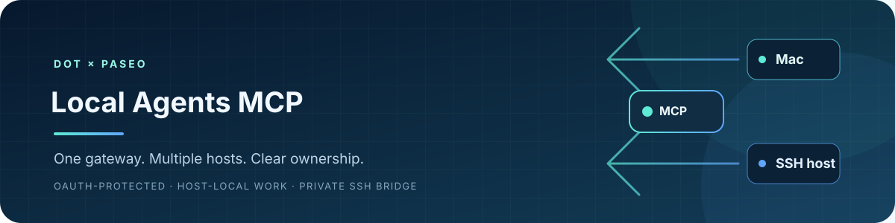
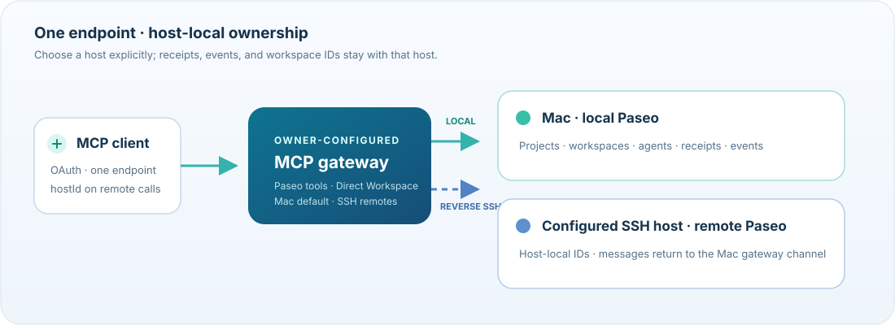

<p align="center">
  
</p>

<p align="center">
  简体中文 · <a href="README.md">English</a>
</p>

<p align="center">
  <a href="NOTICE"></a>
  <a href="https://github.com/xixilys/dot-gpt-local-agents-mcp/actions/workflows/ci.yml"></a>
  
</p>

**通过一个受 OAuth 保护的 MCP 端点，在 Mac 和可经 SSH 访问的 Linux/WSL 主机上管理 Paseo agent，并使用按项目授权的 Direct 文件与命令工具。**发现主机、指定任务运行位置，并通过同一个客户端连接读取对应回执和事件。

这是供单一可信所有者使用的自托管网关。agent 在所选主机上运行，使用该主机安装的 Paseo 和运行时权限。网关不提供模型账号、托管服务或操作系统沙箱。



## 功能

- **单一端点，明确选择主机。**`list_hosts` 返回每台主机的 `hostId`、名称和可用状态。工具接受 `hostId`；省略时保持兼容旧调用，默认使用 Mac。远程调用以及后续事件或回执读取都应显式传入 `hostId`。
- **任务与历史按主机隔离。**项目、workspace、agent、回执、消息和回调都属于各自主机。网关不会跨机器猜测或查找 ID。
- **沿用已有 Paseo。**网关连接 Mac 上的 Paseo 实例和显式配置的 SSH 主机。它不会继承 Paseo 桌面端的主机列表、远程安装 Paseo、启动其 daemon，也不会改动 Provider 或凭据。
- **远程消息回到 Mac 网关。**远端主机上的固定 CLI 通过 reverse SSH Unix-socket forward 连接到 Mac 上该主机专属的 channel。消息由 Mac 网关集中持久化，不会新增公网消息端点。

## 快速开始

下面是 0.4.0 多主机配置的结构示例。请将示例路径和主机值替换为你控制的实际值。Mac 主机默认存在；这里只列额外远端主机。

```sh
git clone https://github.com/xixilys/dot-gpt-local-agents-mcp.git
cd dot-gpt-local-agents-mcp
npm ci --ignore-scripts
cp config.example.json config.json
```

配置一个 OAuth 网关和需要使用的主机。Mac 的现有字段继续放在顶层；远端主机写入 `hosts`：

```json
{
  "publicBaseUrl": "https://gateway.example.com",
  "port": 6768,
  "upstreamUrl": "http://127.0.0.1:6767/mcp/agents",
  "stateDir": "/Users/you/.local/share/local-agents-mcp",
  "ownerTokenFile": "/Users/you/.local/share/local-agents-mcp/owner.json",
  "paseoCommand": "/Applications/Paseo.app/Contents/Resources/bin/paseo",
  "allowedRoots": ["/Users/you/Projects"],
  "hosts": [
    {
      "id": "wsl",
      "name": "WSL",
      "transport": "ssh",
      "target": "ssh://linux-host",
      "allowedRoots": ["/home/you/project"],
      "remoteStateDir": "/home/you/.local-agents-mcp-bridge/gateway"
    }
  ]
}
```

启动服务前，先在 Mac 的状态目录中创建私有 owner 密码文件。密码和状态目录应放在源码仓库之外。网关进程与本机 Paseo 应由同一个 Mac 用户运行。每台远端主机都必须已安装并运行 Paseo；SSH 身份须能通过你现有的 OpenSSH 认证配置访问它。远端 `allowedRoots` 会在远端解析规范路径后检查；这是路径策略，不是操作系统沙箱。请为 `remoteStateDir` 及其父目录选择能通过 bridge 私有目录检查的权限；已有目录不会被自动改成私有权限。

Mac 上的 Paseo observer helper 使用应用自带的 Electron runtime 和客户端。原有支持配置为 Paseo **0.10.3**，安装位置是 `/Applications/Paseo.app`；其他版本或路径仍需验证。网关要求 Node.js `>=22.19 <27`、npm 和 `better-sqlite3` **13.0.3**，该版本提供 Node-API 预构建二进制。`npm ci --ignore-scripts` 会继续禁用依赖 lifecycle scripts；支持预构建包的平台无需手动编译原生模块。未提供预构建包的平台或主动选择源码编译时，可能需要 C/C++ 工具链、Python 和官方 Node headers。

```sh
npm run check
npm test
npm start
```

每个配置端口和状态目录只运行一个网关。请在 `127.0.0.1:6768` 前配置 HTTPS reverse proxy，保留 authorization 和 MCP headers，并让兼容客户端连接 `https://<your-origin>/mcp`。TLS、代理限流、服务管理和客户端注册由运维者负责。Paseo 的 loopback 端点必须保持私有。仓库不会配置 tunnel 或修改防火墙规则。

OAuth client 通过动态注册生成。授权使用 `local-agents` scope、S256 PKCE 和准确的 MCP resource URL（`https://<your-origin>/mcp`）。Access token 有效期为一小时，refresh token 为 30 天。重定向允许 `chatgpt.com`、`chat.openai.com` 和 loopback 主机（`localhost`、`127.0.0.1`、`::1`）；其他客户端重定向主机需要有意修改源码。对外开放前，请在代理上为注册和授权端点设置速率限制。

<details>
<summary>创建 owner 密码文件</summary>

以下命令会创建权限受限的文件；如果文件已存在则不会覆盖：

```sh
node --input-type=module <<'NODE'
import { mkdir, chmod, writeFile } from 'node:fs/promises';
import { homedir } from 'node:os';
import { join } from 'node:path';
import { randomBytes } from 'node:crypto';
const dir = join(homedir(), '.local', 'share', 'local-agents-mcp');
await mkdir(dir, { recursive: true, mode: 0o700 });
await chmod(dir, 0o700);
await writeFile(join(dir, 'owner.json'), JSON.stringify({
  ownerToken: randomBytes(32).toString('base64url')
}) + '\n', { mode: 0o600, flag: 'wx' });
NODE
```

</details>

## 选择主机并跟进任务

先调用 `list_hosts`。选择远端主机时使用返回的 `hostId`，并将它与该主机的 `workspaceId`、`agentId`、`requestId` 和 `routeId` 一起保存。为兼容旧调用，Mac 请求可以省略 `hostId`。读取远端结果、等待任务、读取消息和后续跟进时都应传入同一个 `hostId`，这样网关无需推断某个 ID 属于哪台机器。

常规流程是在选定主机上发现项目与 Provider 能力，选择或创建该主机的 workspace，再使用稳定的 `requestId` 派发。回执只能确认已提交，不能证明任务已完成。如果结果为 `unknown` 或仍处于 `submitting`，应检查原始请求及该主机的 timeline；确认原操作是否运行前，不要换一个 ID 重发。验收前要检查实际产物。

`wait_for_agent_result` 使用原始 `requestId` 和准确的 `agentId`，总等待预算为 1–20 秒。`idle`、终态观察、可读取的文本和任务成功彼此不同；`acceptancePassed` 仍为 `null`。超时后可重新读取，不会取消或重新派发任务。Timeline 页面最多 1 MiB；请按返回的 cursor 继续读取，并检查 gap/stale/reset 标记。

workspace 根目录只限定网关可以选择的项目路径，不会限制 agent 进程可执行的操作。获授权的客户端仍可读取和控制这些根目录中的 agent，包括取消任务、调整 runtime 设置和响应特定权限请求。只授权给你信任其拥有这些权限的 OAuth 客户端。

## Direct Workspace

Direct Workspace 在现有 Node.js 网关中增加按项目授权的文件与命令工具，与各主机 Paseo daemon 提供的工具并列。设计借鉴并适配了 Codex Bridge Direct；它不是 Swift runtime 集成，也不代表完整协议兼容。它沿用相同的 `hostId` 路由规则；省略 `hostId` 时仍指 Mac。

十个工具分别是：`list_direct_projects`；`list_direct_files`、`search_direct_files`、`read_direct_file`、`write_direct_file`、`edit_direct_file`；以及 `run_direct_command`、`read_direct_command`、`write_direct_command_input`、`cancel_direct_command`。Direct project 在本地按主机配置。Mac 的 `direct.projects` 放在顶层；SSH 主机的 `direct.projects` 放在对应 host 条目内：

```json
{
  "direct": {
    "projects": [
      {
        "id": "example",
        "name": "Example project",
        "path": "/Users/you/Projects/example",
        "read": true,
        "write": false,
        "commandMode": "disabled"
      }
    ]
  }
}
```

默认允许读取、关闭写入和命令。需要时可对单个 project 启用写入。文件写入必须提供 `expectedSha256`：仅新建文件时使用 `null`；更新文件须提供当前整文件 hash，若内容已变化则拒绝写入，你可以先重新读取再编辑。`edit_direct_file` 也会在替换指定文本前核对整文件 hash。

命令可以保持禁用；也可以设置 `commandMode: "registered"` 并由所有者配置精确的 `argv` 条目（例如 `{ "name": "test", "argv": ["npm", "test"] }`）；或显式使用 `commandMode: "full"` 传入字面参数数组。命令使用所选主机的正常操作系统权限运行。项目工作目录和 allowed roots 用于限定项目文件与工作目录，不会沙箱化命令，也不会限制命令只能访问该目录。

命令请求以 `requestId` 持久记录：再次读取会返回原记录，不会重新运行。交互式 stdin 写入使用可去重的 `inputId`；命令输出有界，并通过 cursor 分页。若网关在进程运行期间重启，请求记录可能变为 `interrupted` 或 `unknown`；网关不承诺恢复该进程。Direct Workspace 的可用性独立于 Paseo daemon 健康状态。

## Direct binary files

Direct binary transfer 在项目与网关之间传输原始文件字节，不把内容放进模型文本或 base64，也不经由 Drive 或 Git。本机与 SSH/WSL 使用固定的流式传输路径。每次调用都选择 `hostId`；导出和导入还会指定 `projectId`。导出沿用项目已有的读取权限，导入沿用写入权限。

| 工具 | 用途 |
| --- | --- |
| `export_direct_file` | 传入 `hostId`、`projectId`、`path` 和稳定的 `requestId`。网关生成不可变快照，并返回字节数、SHA-256，以及现有 MCP 域名下的单文件 HTTPS 链接。单文件上限 256 MiB；有效快照总量上限 512 MiB，10 分钟后过期。 |
| `import_direct_file` | 传入 `hostId`、`projectId`、目标 `path`、`expectedSha256` 和由调用者授权的文件输入。新建文件使用 `expectedSha256: null`；覆盖已有文件须提供目标当前 hash。网关先下载到私有 spool，再在选定主机上原子写入文件。 |
| `get_direct_transfer` | 使用原始 `hostId` 和 `requestId` 读取已记录结果。已完成或确定失败的回执可恢复 24 小时，不要复用它们的 ID 开始新工作。未知或中断记录会保留，重启后也不自动重做；有界回执存储满时拒绝新传输。 |

ChatGPT 文件输入遵循官方 `_meta["openai/fileParams"]` 格式：`download_url` 和 `file_id` 必填，`mime_type` 和 `file_name` 可选。详见 [OpenAI 文件输入参考](https://developers.openai.com/plugins/reference)。网关只从公网 HTTPS URL 拉取文件。

导出链接是短期 bearer capability，只指向一个文件：在过期前，任何拿到链接的人都能下载快照。不要公开或写入日志。撤销 OAuth owner 时，也会撤销该 owner 尚有效的下载 ticket。HTTP 下载本身不会重新验证或证明收到链接的 OAuth client 身份。网关重启后，旧下载 ticket 会失效，未完成的传输回执会变为 `interrupted`；用原始 `requestId` 查询记录状态。

**返回 `resource_link` 或 URL 不代表接收端已经下载文件。**只有接收端真正下载并保存字节、核对返回的字节数与 SHA-256，并在使用位置加载文件后，才算交付完成。有些云端客户端可能无法直接通过 HTTPS 获取该链接；此时这条路径存在实际落盘能力缺口。不要悄悄改用 Drive 或 Git 后仍称作同一种原生传输。

## 事件与 agent 消息

旧 tools transport 和 `2026-07-28` MCP Events adapter 共用 `/mcp`。支持 Events 的客户端订阅 `agent.attention` 时，应显式传入 `hostId`、`workspaceId`，并为每个聊天使用稳定且唯一的 `routeId`，同时提供 HTTPS callback 和签名密钥。通过 `list_notification_routes` 确认路由后，再将它绑定到任务。已有请求可以用原始 request ID 和显式 route 添加 watch；这不会创建 agent、发送 prompt 或改绑到其他 route。订阅、route 绑定、`notifyOnFinish` 或成功的回调投递记录，都不能证明客户端已被唤醒或任务已成功。客户端不支持 Events 时，可直接读取或等待结果。

远程任务使用固定消息 CLI；CLI 在远端主机运行，通过 reverse SSH Unix-socket forward 连接到 Mac 网关上该主机专属的 channel。消息由 Mac 网关集中持久化；此机制不会创建公网入站消息服务。各主机的回执、路由和回调状态仍彼此独立。主机不可用时，不能静默回退到 Mac 获取其数据；状态不确定的请求必须在原主机检查，不应换到其他机器重新提交。

回调要求 HTTPS、通过验证的 challenge、公网 DNS/IP 目标和 Standard Webhooks 签名。投递前会检查解析出的地址、拒绝重定向和私有/本地目标，并使用持久化 outbox；遇到临时错误最多重试五次，HTTP 410 后停止投递。订阅默认持续一天（`ttlMs: null` 表示七天）；过期前应刷新。当前不支持 cursor replay（`cursor: null`）；请通过读取工具恢复准确结果。监控结束后取消订阅，同时保留其他无关路由。

## 安全与数据

对外开放网关前请阅读 [SECURITY.md](SECURITY.md)。这是单一所有者的权限域，不是多租户服务。请保护 owner 密码、OAuth 状态、回调 URL/密钥、回执、agent capability、消息和任务结果。状态数据保存在本地但未加密；也要保护备份，以及同一操作系统用户下其他进程的访问权限。

Mac 和远端 `allowedRoots` 检查都会解析规范路径，并拒绝越界目标和符号链接逃逸。这些是网关检查，不是操作系统沙箱。SSH 访问遵循操作者现有的 OpenSSH 认证配置；不要通过公开 MCP 工具接受任意 URL 或 SSH 命令。网关不会静默安装或启动远程服务，也不会配置 Provider 或传递凭据。OAuth client 通过动态注册生成；`local-agents` 是必需的 scope，不是固定 client ID。MCP resource URL 是配置的公开 origin 加 `/mcp`。

公开源码快照不包含生产配置、运行时数据库、捕获的会话、私有回调 URL 或运维历史。不要将这些内容用作公开示例。

## 开发与归属

```sh
npm ci --ignore-scripts
npm run check
npm test
```

项目使用 scoped override，将 `@waishnav/devspace` 下的 SQLite 依赖固定到 `better-sqlite3` 13.0.3 及其 Node-API 预构建包，支持平台无需额外源码编译；详见 [13.0.0 官方发布说明](https://github.com/WiseLibs/better-sqlite3/releases/tag/v13.0.0)。CI 使用 Node.js 22.19 和 24 运行语法检查及仓库中的行为/安全测试。主机状态显示可用，表示配置的 Paseo daemon 有响应；这不能证明所有任务、消息或事件流程都正常。请在自己的部署环境中验证实际使用的客户端和工作流。

除带 Apache 标记的 Direct 模块与测试外，项目原始代码和文档采用 [MIT](LICENSE) 许可，版权归 xixilys 所有，年份为 2026。`src/direct-*` 中经过修改的 Node 模块及带 Apache SPDX 标记的 Direct 测试源自 Codex Bridge Direct 的 [revision `f881877`](https://github.com/Fanch-hui/codex-bridge/tree/f881877183bb1f5d355124caf6b86cb7f2323e53)，采用 Apache-2.0 许可；详见 [NOTICE](NOTICE) 和 [third_party/codex-bridge-LICENSE](third_party/codex-bridge-LICENSE)。Paseo schema fixture 也采用 Apache-2.0，许可文本见 [third_party/paseo-LICENSE](third_party/paseo-LICENSE)。此处不附带依赖或 Paseo 二进制文件；它们各自遵循其许可与使用条款。
